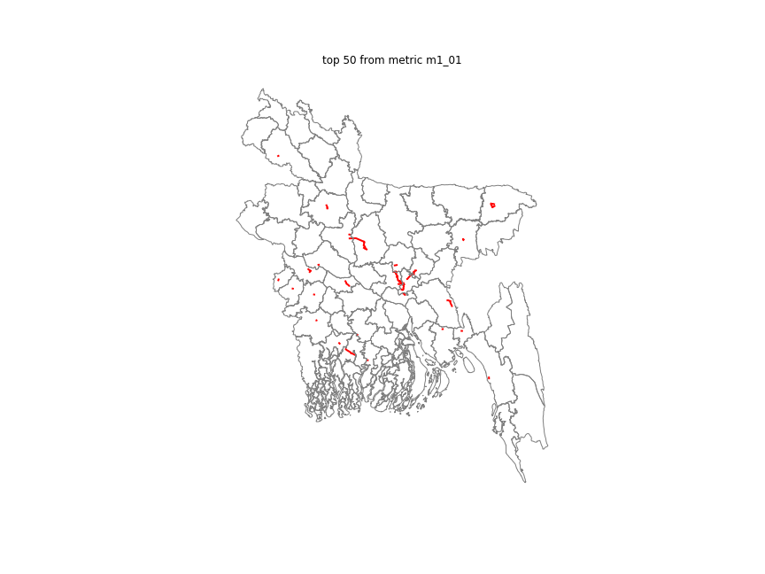
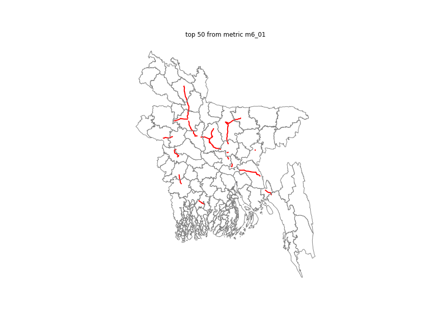

# Transport Network Criticality Analysis
#### Repository of transport network modeling and criticality analysis Python library, along with documentation of a master thesis entitled: "Measuring freight transport network criticality: A case study in Bangladesh"
#### Author: Bramka Arga Jafino (bramkaarga@gmail.com)
#### MSc in Engineering and Policy Analysis, Delft University of Technology, The Netherlands 

***Brief summary of the thesis***

Transport network criticality studies mostly focus on developing new criticality metrics or new assessment techniques. However, the discussion about the concept of criticality at an abstract level is missing. Moreover, most studies only use few (usually 1-4) number of criticality metrics. Therefore, the master thesis contributes in identifying the general aspects of 'transport network criticality' itself. The aspects are further operationalized into ten categories of criticality metrics. From these categories, eighteen metrics were selected and tested on a real-world Bangladesh multimodal (road + waterway) transport network. By using correlation coefficients, metrics that were overlapping (i.e. highlighting the same transport segments as critical) were identified. Lastly, a selection method was developed to help practitioners in selecting an appropriate set of metrics to be used given their study objective, their data availability, and their preferred computational expense, while still incorporating as many criticality aspects as possible. The full report can be found [here.](https://repository.tudelft.nl/islandora/object/uuid%3A0905337b-cdf7-4f6e-9cf6-ac26e4252580?collection=education)

***A short guide to the repository***

The full scripts for the transport network modeling and criticality analysis can be found inside folder [**transport_network_modeling.**](https://github.com/bramkaarga/transcrit/tree/master/transport_network_modeling) The standard four-stage transport modeling implementation from the scripts (O-D matrix calculation and network assignment) is provided in [**01_example_metric_calculation.ipynb.**](https://github.com/bramkaarga/transcrit/blob/master/01_example_metric_calculation.ipynb) 

The other files in this repository are specifically related to the master thesis. However, some functions from the scripts can be relevant and reused for other similar projects.

***Bangladesh multimodal freight transport network criticality analysis***

Eighteen criticality metrics were calculated on top of the Bangladesh multimodal freight transport network. They are:

|Code         |  Metric|
|:-------------:|:-------------:|
|M01_01 | Change in unweighted daily accessibility|
|M01_02 | Change in number of nodes accessible within daily reach|
|M02_01 | Change in unweighted total travel cost|
|M02_02 | Change in network average efficiency|
|M03_01 | Unweighted link betweenness centrality|
|M03_02 | Change in region-based unweighted total travel cost|
|M04_01 | Minimum link cut centrality|
|M04_02 | OD k-connectivity|
|M05_01 | Nearby alternative links (simplified)|
|M06_01 | Change in weighted accessibility|
|M07_01 | Change in weighted total travel cost|
|M07_02 | Change in expected user exposure|
|M07_03 | Change in worst-case user exposure|
|M08_01 | Traffic flow data|
|M08_02 | Weighted link betweenness centrality|
|M08_03 | Volume over capacity|
|M09_01 | Unsatisfied demand|
|M10 | Exposure to disaster|

The raw results of each metric can be found in [**criticality_results**](https://github.com/bramkaarga/transcrit/tree/master/criticality_results) folder. An interactive visualization of the criticality outcomes from all results can be seen in [**02_geovisualization.ipynb.**](https://github.com/bramkaarga/transcrit/blob/master/02_geovisualization.ipynb) However, the interactivity can only work if the notebook is run locally on a machine. The visualization enables users to highlight the top *n* critical links from any metric similar to the examples in the following animation (highlights of top 50-300 critical links from metric M1_01 and M6_01).

Metric M1_01        |  Metric M6_01
:-------------:|:-------------:
 | 

The results are then analyzed in order to identify the overlapping metrics (metrics that highlight the same set of links as critical) and the complementary metrics (metrics that highlight different set of links as critical). The analysis is provided in [**03a_criticality_result_analysis.ipynb**](https://github.com/bramkaarga/transcrit/blob/master/03a_criticality_result_analysis.ipynb).

The robustness of each metric to uncertainties in model parameters is tested in [**03c_criticality_result_analysis_robustness.ipynb**](https://github.com/bramkaarga/transcrit/blob/master/03c_criticality_result_analysis_robustness.ipynb) while the robustness of the metrics overlap/complementarity to different network structure is provided in [**03b_criticality_result_analysis_subnetworks.ipynb**](https://github.com/bramkaarga/transcrit/blob/master/03b_criticality_result_analysis_subnetworks.ipynb).

Lastly, two hypothetical case studies by using Bangladesh's multimodal freight transport network were utilized to test the metrics selection method (please refer to the thesis report for the explanation). The analysis is provided in [**04_illustrative_case_study.ipynb**](https://github.com/bramkaarga/transcrit/blob/master/04_illustrative_case_study.ipynb).

***License***

This repository is published under the [BSD 3-Clause License.](https://github.com/bramkaarga/transcrit/blob/master/LICENSE)
